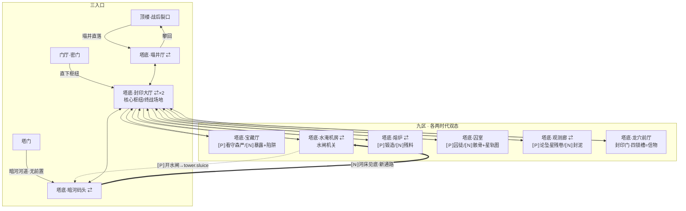

> ⚠️ **已被取代（2026-09）**：设定部分已被 `docs/lore-canon.md`（v14 正史「送它回家」）整体重写取代，**不再具权威**。保留仅供追溯设计过程。

# 第三章地图：塔底双时代环路（C1 #49）

> Melan 图双时代版。`⇄` = 共鸣锚（免费切换）；实线 = 通路；`⟦P⟧` = 仅过去 / `⟦N⟧` = 仅现在。

## 跨时代机关（C1 落地 1 条主链）

| # | 动作（past） | 后果（present） | 验证 |
|---|---|---|---|
| 水闸 | 机房转动水闸 → `tower.sluice` | 暗河码头河床见底，露出「顺河床深入机房」直通廊（C2↔ENG 环路） | 路线 M 断言链接出现 + flag |

后续（C2/C3）：囚室遗物↔past 开门、宝藏厅 lore 兑现、熔炉修理/打造、观测廊星图对接（龙弱点情报）。

## 共鸣锚（Shifts.anchors，六锚）

塌井厅 · 暗河码头 · 封印大厅（×2，终战双锚）· 水淹机房 · 熔炉 · 观测廊

锚内 `<<anchorshift>>` 免费无限（不耗充能——`amulet_charges` 不变，路线 M 断言）；锚外无切换。与二章 `<<erashift>>`（充能门控）并存。
